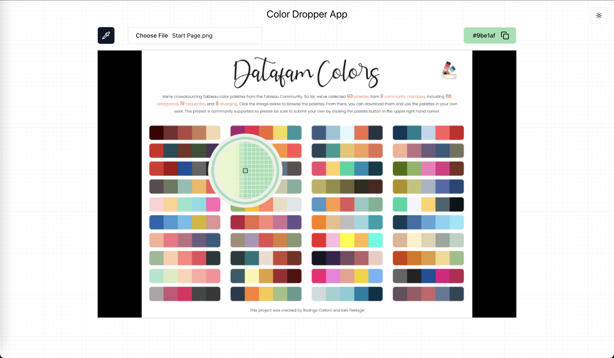

# Color Dropper Tool

## Overview

The **Color Dropper** tool is a functionality for a web-based photo editor that allows users to pick colors from a canvas, display the corresponding hex code in real-time while hovering, and copy it to the clipboard with a click. It provides a magnifying glass effect for precise color selection, and the hex code of the color is dynamically displayed in the header as the user hovers over the canvas.

This project is implemented using **HTML Canvas** and **TypeScript**, handling large canvases up to 16MB (4000x4000 resolution). The focus is on functionality and performance.

## Features

- **Canvas-based Color Picking**: Allows users to hover over the canvas to preview and select colors.
- **Real-time Color Display**: The hex code of the color being hovered over is displayed live in the header.
- **Color-Matched Border**: The color circle's border changes to match the hovered color.
- **Magnifying Glass Effect**: The circle acts as a magnifying glass, zooming in on the canvas area underneath for accurate color picking.
- **Click to Copy**: Clicking on the color dropper will copy the hovered color's hex code to the clipboard.

## Screens

### Product Requirements

- **Real-time Color Preview**: 
  - While hovering over the canvas, the current color's hex code is dynamically displayed in the header.
  - The circle overlay shows the hex code and matches its border to the hovered color.
  - The circle also magnifies the underlying area for precision.
  
- **Click to Copy**: 
  - When a user clicks on the canvas, the hex code of the current color is copied to the clipboard.


### UI Example


- **Picture 1**: Shows the dropper tool in action, with a circle overlay displaying the color hex code and magnifying the area.


## Technical Requirements

- **Canvas Support**: Must handle large canvases, up to 4000x4000 pixels (16MB).
- **TypeScript**: The project is written in TypeScript for better type safety and scalability.

## Installation

1. Clone the repository:

   ```bash
   git clone https://github.com/KaroMourad/color-dropper.git
   ```

2. Install dependencies:

   ```bash
   pnpm install
   ```

3. Run the development server:

   ```bash
   pnpm run dev
   ```

## Usage

1. Load an image onto the canvas.
2. Click the dropper icon to activate the color dropper tool.
3. Hover over the canvas to see real-time color previews in the header.
4. Click on a color to copy its hex code to the clipboard.

## Performance

The tool is optimized for large canvases (up to 16MB), ensuring smooth interactions during color selection.

## Contributing

We welcome contributions! Feel free to submit issues or pull requests to improve the tool.

---

Enjoy using the **Color Dropper** tool!